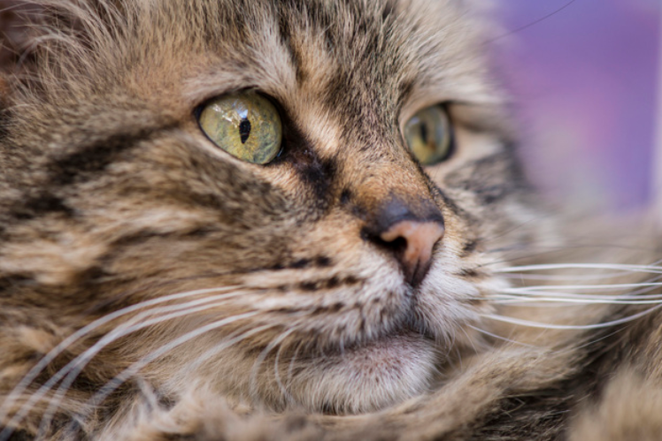

Samantha Prestrelski

## Overview
This site holds my work for **CSE 15L: Software Tools & Techniques Lab** during *Winter Quarter 2022*.  
Course website: [https://ucsd-cse15l-w22.github.io](https://ucsd-cse15l-w22.github.io) 

| Lab  | Due date   |
|------------|------------|
|[Week 2 Lab Report](https://sprestrelski.github.io/cse15l-lab-reports/labs/week2labreport) | 01/15/2022 |
|[Week 4 Lab Report](https://sprestrelski.github.io/cse15l-lab-reports/labs/week4labreport) | 01/28/2022 |
|[Week 6 Lab Report](https://sprestrelski.github.io/cse15l-lab-reports/labs/lab-report-3-week-6) | 2/11/2022 |



---
> 1. One
> 2. Two
> 3. Three

* List `Example 1`
* List `Example 2`
* List `Example 3`

```python
#this is a code block
print('hello world!')
```