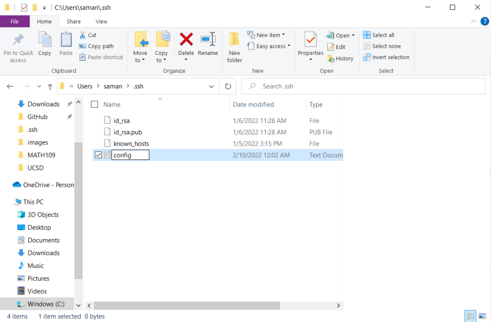
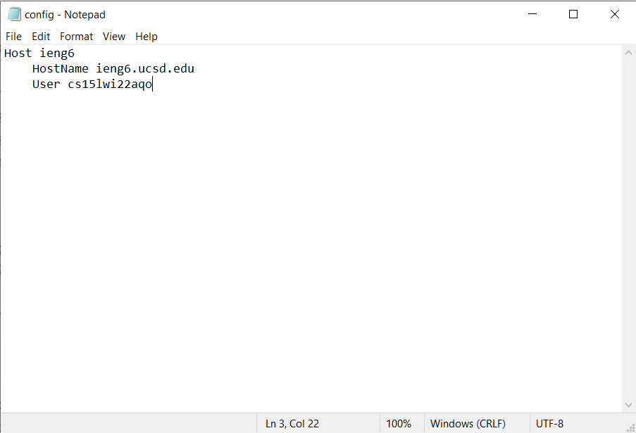
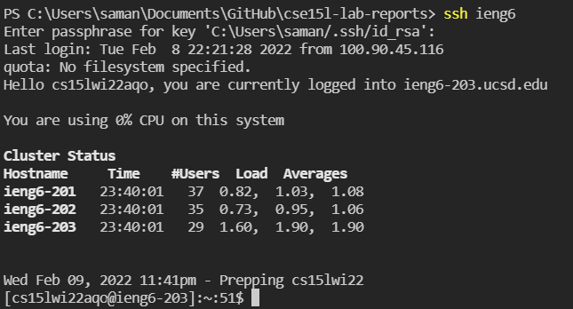
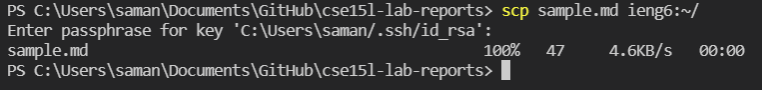

# Week 6 Lab Report
**Objective**: How do you streamline `ssh` configuration?  
**Due date**: Friday, February 11, 2022  
**Lab report requirements**: [https://ucsd-cse15l-w22.github.io/week/week4/](https://ucsd-cse15l-w22.github.io/week/week6/)  

To streamline the process of `ssh`-ing into a server, we can make a configuration file. The contents of my `.ssh/config file` are as follows:
```
Host ieng6
    HostName ieng6.ucsd.edu
    User cs15lwi22aqo
```

The `config` file goes into the `.ssh` folder. To make the file using the Windows filesystem GUI, select the "Make a New Text Document" option, then remove the `.txt` file extension. This should turn it into a `File`, just like the `id_rsa` and `known_hosts` files in the following screenshot.  
  

Then, I edited the file in Notepad. I decided to keep the hostname "ieng6" rather than choose my own because it was short and corresponded to the server I was logging into, `ieng6.ucsd.edu`.    


Now, when I use the SSH Command to log into my ieng6 account, it becomes a very quick process. Instead of typing out my full course username, I can do `ssh [hostname]` to log into the server.  
  


To copy files from my local machine to ieng6, we can use the SCP command. To copy a file into the base directory using our new configuration file, we can run `scp [filename] [hostname]:~/`.
  
