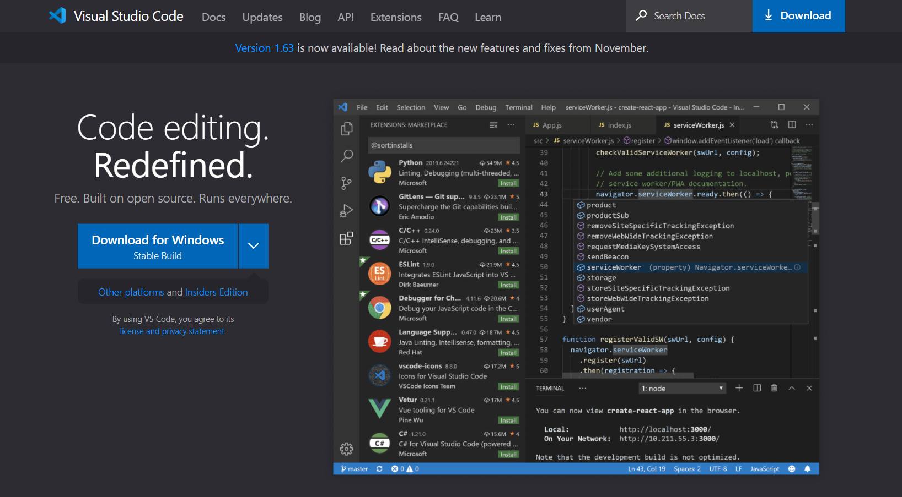
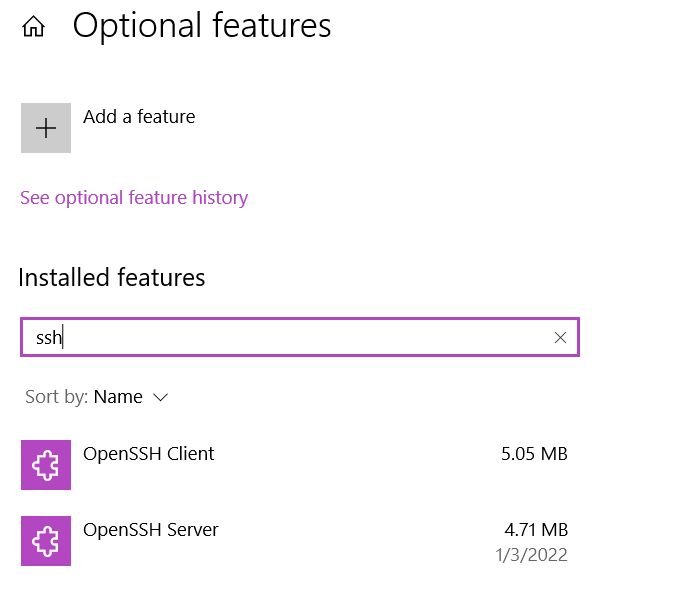
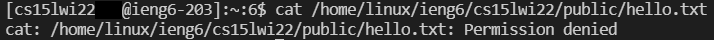
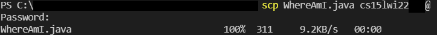
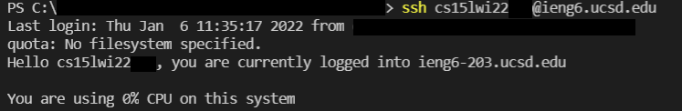
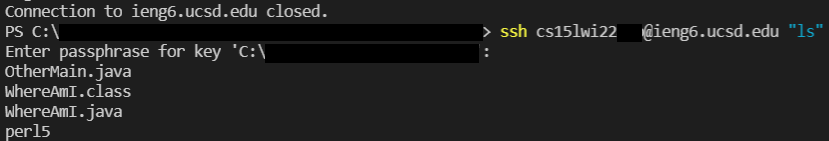

# Week 2 Lab Report
**Objective**: How do you log into a course specific account on `ieng6`?  
**Due date**: Friday, January 15, 2022  
**Lab report requirements**: https://ucsd-cse15l-w22.github.io/week/week2/  

## Installing VScode
This tutorial uses VScode, which you can install at https://code.visualstudio.com/. Download and run the installer for your respective system. I'm using Windows, so this tutorial will cover Windows systems.    




## Remotely Connecting
First, you'll need to install OpenSSH. From the [Windows documentation](https://docs.microsoft.com/en-us/windows-server/administration/openssh/openssh_install_firstuse),  
> 1. Open Settings, select Apps > Apps & Features, then select Optional Features
> 2. Scan the list to see if the OpenSSH is already installed. If not, at the top of the page, select Add a feature, then:  
>     - Find OpenSSH Client, then click Install
>     - Find OpenSSH Server , then click Install




Then, you'll need to look up your course specific account. This can be found at the following website: https://sdacs.ucsd.edu/~icc/index.php.  

Once you know your course account and have reset the [password](https://password.ucsd.edu) to it, open a terminal in VSCode and run the following, except replace `aaa` with your course-specific account. Enter your password when prompted.
```bash
$ ssh cs15lwi22aaa@ieng6.ucsd.edu
```

## Trying Some Commands
Try some of the following commands on the remote server: `cd`, `ls`, `pwd`, `mkdir`, `cp`  

Here's one that I tried:  



## Moving Files with `scp`
To move a file to your directory on the server, we can use the Secure Copy Protocol (scp). Run the following command, and enter your password when prompted.

```bash
$ scp sampleFile.java cs15lwi22aaa@ieng6.ucsd.edu:~/
```

The file should now be on the server, where you can run it on an ieng computer.  




## Setting an SSH Key
To make connecting to the remote server more enjoyable, we'll set up an `ssh` key. This will let us connect to the server without having to put in our password every time.

```bash
$ ssh-keygen
Generating public/private rsa key pair.
Enter file in which to save the key (/Users/joe/.ssh/id_rsa): /Users/joe/.ssh/id_rsa
Enter passphrase (empty for no passphrase): 
Enter same passphrase again: 
Your identification has been saved in /Users/joe/.ssh/id_rsa.
Your public key has been saved in /Users/joe/.ssh/id_rsa.pub.
The key fingerprint is: X
The key's randomart image is: X
```
*stole the ssh-keygen output from [here](https://ucsd-cse15l-w22.github.io/week/week1/)

Since we're on Windows, we also need to complete an extra step with `ssh-add`. Open a PowerShell Window with Administrator permissions. From the [Windows documentation](https://docs.microsoft.com/en-us/windows-server/administration/openssh/openssh_keymanagement#user-key-generation):  
```bash
# By default the ssh-agent service is disabled. Allow it to be manually started for the next step to work.
# Make sure you're running as an Administrator.
$ Get-Service ssh-agent | Set-Service -StartupType Manual

# Start the service
$ Start-Service ssh-agent

# This should return a status of Running
$ Get-Service ssh-agent

# Now load your key files into ssh-agent
$ ssh-add ~\.ssh\id_rsa.pub
```

Copy the public key `id_rsa.pub` to your `.ssh` directory on the server. You should now be able to log in without entering a password.




## Optimizing Remote Running
When `ssh`-ing into the remote server, you can add commands onto the same line to run it directly on the server, then exit. For example,  


To run multiple commands, separate them using `;` and place them inside quotation marks.  
```bash
$ ssh cs15lwi22aaa@ieng6.ucsd.edu "javac WhereAmI.java java; java WhereAmI"
```
