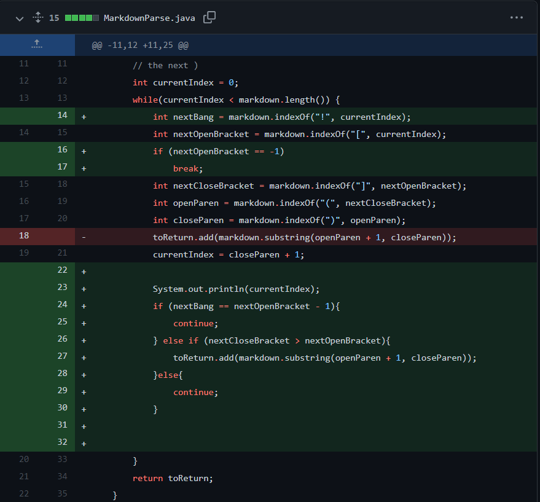
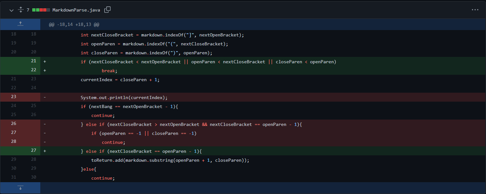
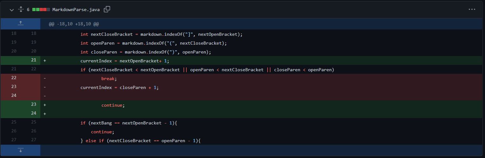

# Week 4 Lab Report
**Objective**: How do you automate testing using JUnit?  
**Due date**: Friday, January 28, 2022  
**Lab report requirements**: [https://ucsd-cse15l-w22.github.io/week/week4/](https://ucsd-cse15l-w22.github.io/week/week4/)

## Code Change 1
  

### Content of Test File
Link to test file: [tester.md](https://github.com/sprestrelski/markdown-parse/blob/main/tester.md)  

```md
# Title

[a link!](https://something.com)
[another link!](some-page.html)

hello what is this?
[a youtube link] (https://www.youtube.com/watch?v=_y9hkrN9k3w)

```
### Symptom
```java
$ java MarkdownParse tester.md
Exception in thread "main" java.lang.OutOfMemoryError: Java heap space
        at java.base/java.util.Arrays.copyOfRange(Arrays.java:3822)
        at java.base/java.lang.StringLatin1.newString(StringLatin1.java:769)
        at java.base/java.lang.String.substring(String.java:2709)
        at MarkdownParse.getLinks(MarkdownParse.java:18)
        at MarkdownParse.main(MarkdownParse.java:26)
```  
### Relationship
The failure-inducing input was that images were also recognized as links when they shouldn't be. This means image links were included in list of links given in the output. Since the format for images is extremely similar to those of links, this makes sense.
```md

[This is a link!](link.com)
```
By checking if there's an exclamation point before the first open bracket (then skipping those links), we can filter out images from our list.    


## Code Change 2
  
### Content of Test File
```
)[
```
Link to test file: [test-file7.md](https://github.com/sprestrelski/markdown-parse/blob/main/provided-tests/test-file7.md)  

### Symptom  
Infinite loop occurs. I couldn't get it to give me an error like the previous code change though, which also produced an infinite loop. sorry :(
```java
$ java .\markdown-parse\MarkdownParse.java .\provided-tests\test-file7.md

```

### Relationship  
The failure-inducing input was brackets or parentheses without their pair. The symptom was again, an infinite loop. The program had no way to stop or ignore these characters, meaning that the while loop continued to forever search for characters without their other halves. This was fixed by adding a `break` keyword to leave the loop.

## Code Change 3
  
### Content of Test File
```md
# Title
this [] should maybe break it

[hello](goodbye.com)


Hello!
```
Link to test file: [new-test.md](https://github.com/sprestrelski/markdown-parse/blob/main/markdown-parse/new-test.md)

### Symptom  
```java
$ java MarkdownParse .\markdown-parse\new-test.md 
[]
```

### Relationship
The failure-inducing input was a pair or brackets without a pair of parentheses following it.   
  
In the previous code change, a `break` keyword was added to break out of the infinite loop caused by unpaired brackets/parentheses. However, if there are links after those pairs, the program cannot parse them and will not output valid links.  
  
By changing the `break` to `continue` and moving the line that changed `currentIndex` for the while loop to after the `continue` statement, this allowed the program to keep parsing the file.